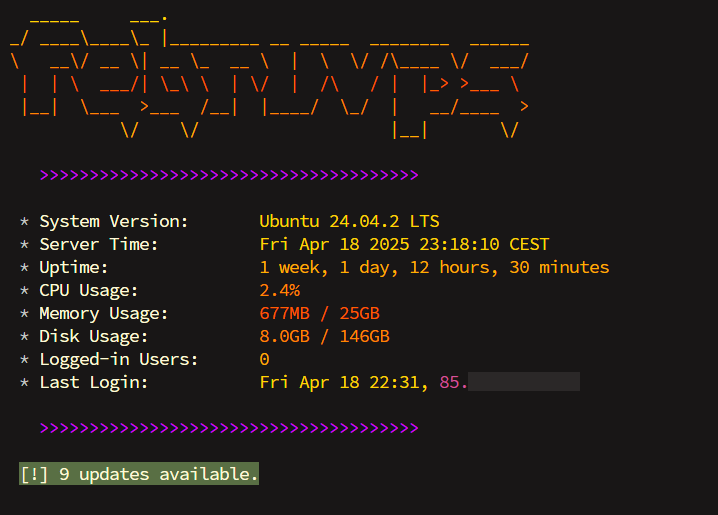

# febru's scripts
 
 This repository contains bash scripts which I created. They are written and tested on my beloved Ubuntu. I run each of them through [ShellCheck](https://www.shellcheck.net/) before publishing it here so there shouldn't be any major fuckups in their logic *(hopefully)*. You can find specification of every script below. 
 
 > Also note that you are more than welcome to fork or create a pull request if you want to add something valuable to this repo. I'm still learning bash scripting so it's more than appreciated!

 ## motd.sh

This script displays a MOTD message with useful statistics and notifications about available updates, current tmux sessions and pending reboots. You can replace the ASCII art with your own (I used [this generator](https://patorjk.com/software/taag/)). Also feel free to add more notifications or modify the color palette.

To make this script work as intended, give it the ability to execute using `chmod +x motd.sh` and place it in `/etc/update-motd.d` directory (for Ubuntu).

